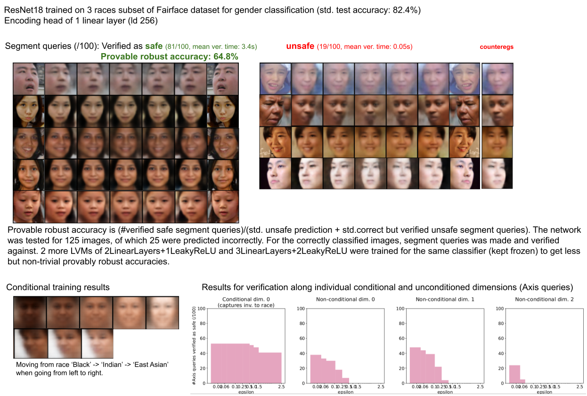

# Efficient Verification of NNs against LVM-based Specifications

This is the codebase for the verification pipelines and experiments in our work on 'Efficient Verification of Neural Networks against LVM-based Specifications'.
## Setup
   - To use the codebase for the proposed SRVP pipelines or LVM trainings, install all packages in requirements.txt. Run `python3 -m tests.tests` to ensure that tests run.
   - To use the codebase for verification using:
        - Open-source version of VeriNet toolkit: Setup VeriNet from [github repo](https://github.com/vas-group-imperial/VeriNet). Additional patches are required as provided in [verinet_patches](verifiers/opensource_verinet_for_srvp.patch).
        - Proprietary version: Contact me or other authors to get you the licensed VeriNet version and setup.

For both versions, you will need the [Xpress solver](https://www.fico.com/en/products/fico-xpress-solver) (with a license, for verifying pipelines with their verification paths including >5k activations).

Run `export PYTHONPATH=$PYTHONPATH:$(pwd)/<path to downloaded verifier>` such that verinet folder is in the python search path, and ensure that `python3 verifiers_utils.py` runs successfully.
## Usage
Commands for various uses of this codebase are as follows:
1. To train the verification pipeline elements:
`python3 train.py --config_file=*<path to config file>*`
    * Config file should have a dict with the following parameters in a dict (see [sample_configs/*](sample_configs) for reference):
        >`# Dataset related params` \
            "dataset": *MNIST/FashionMNIST/CelebA/TrafficSignsDynSynth/Objects3d* \
            "input_shape": *[C, H, W]* \
            "data_balance_method": *None/reduce/increase* \
            "classes": *'default' for standard torch datasets, list of attribute names for CelebA, 'dir_based' for custom datasets* \
            "conditional": *list/dict specifying the classes/attributes to condition on* \
            "batch_size": *xx* \
        `# Encoding head related params` \
            "latent_dim": *xx* \
            "loss_kl_weight": *xx* \
            "loss_conditional_weight": *xx* \
            "loss_recons_weight": *xx* \
            "conditional_loss_func": *[CE/MSE/Generator]* \
        `# Learning related params`\
            "num_epochs": *xx* \
            "lr": *xx* \
            "train_cla": *when verifying pretrained classifiers, whether to also train them or not* \
            "only_cla_training_epochs": *last x epochs to only train the classifier* \
            "only_vae_training_epochs": *\# of epochs to only train the vae (relevant when training both classifier and VAE)* \
            "GAN_start_training_epochs": *Epochs from when to start also optimising against GAN loss* \
        `# Classifier to be verified` \
            "model": *specify params to construct the subnetworks like classifier, VAE, etc.* \
        `# Run identifiers` \
            "desc": *short description added to summary tag and results folder* \
            "notes": *longer detailed notes*

2. To verify a trained classifier (pipeline) for different datasets:
    * MNIST, FashionMNIST, TrafficSignsDynSynth:
        * For every image i in dataset, verifies for an input set [i, transform(i)] for all transform in test_transforms (till the range and in steps specified): \
            `python3 verify.py --model_path=<path to resp. model.tar>`
    * CelebA:
        * For an image in dataset, verifies invariance against a test_attribute or against head tilt: \
            `python3 verify.py --model_path=<path to CelebA_model.tar> --test_attribute=<any attribute> --flip_head=True/False`
    * Object10:
        * Given transforms {tA, tB}, for an image i, verifies for an input set [tA(i), tB(i)]: \
            `python3 verify.py --model_path=<path to Object10_model.tar> --test_attribute=<attrA> --target_attributes=<attrB,attrC>` \
    For each dataset image, the script also verifies for eps in conditional dimensions if any.

3. To reproduce experiment results:
    - All reported networks are defined in [model.py](model.py), [models_impl/](models_impl) and notebook/notebook_utils.py.
    - Most reconstruction outcomes in Table 1 can be reproduced from a straightforward run of the EDC_SRVP_pipelines_and_decoders_comparison.ipynb notebook. Some reported SRVP pipelines requires training as explained in 1. using configs in [sample_configs](sample_configs). Some trained pipelines from this run are uploaded as release with the repo, for user to run the verification scripts in the next step directly.
    - (Requires VeriNet) Some verification outcomes in Table 1 and in Appendix can be reproduced by running [bounds_computation.py](bounds_computation.py) and notebook/verification_comparison.py on the trained pipelines. Some verification results require a verification run as explained in 2. above. 

### Example usage
```bash
export PYTHONPATH=$PYTHONPATH:$(pwd)/<path to downloaded verifier>
python3 train.py --config=sample_configs/FashionMNIST_conv.txt
python3 verify.py --model_path=<path to FashionMNIST model trained above or one in the release> --num_test_images=10
```

## Datasets
- The Object3D dataset (3DOD) can be generated in Blender with [this script](data/objects10_3Dpose_dataset_generation.blend11) for the CAD models as in the [ModelNet10 dataset](https://3dshapenets.cs.princeton.edu/).

## Additional experiment results for Fairface dataset


## Featured Outcomes and Demos
Below are the sample reconstruction outcomes for some SRVP pipelines LVMs.

Watch through the videos below to see the specific changes in object reconstructions with changes in disentangled conditional dimensions (generated using [notebooks/SRVP_pipelines_qualitative_evaluation.ipynb](notebooks/SRVP_pipelines_qualitative_evaluation.ipynb)).

https://user-images.githubusercontent.com/14110609/201974045-bda27395-f399-4e4a-8ff0-9a054c153a6d.mp4

https://user-images.githubusercontent.com/14110609/201974099-ae460e15-a643-4e90-a040-0cee2df279a9.mp4

## License and Copyright
* Copyright (c) 2023 [Verification of Autonomous Systems (VAS) Group, Department of Computing, Imperial College London](https://vas.doc.ic.ac.uk/)
* Licensed under the [MIT License](LICENCE)
